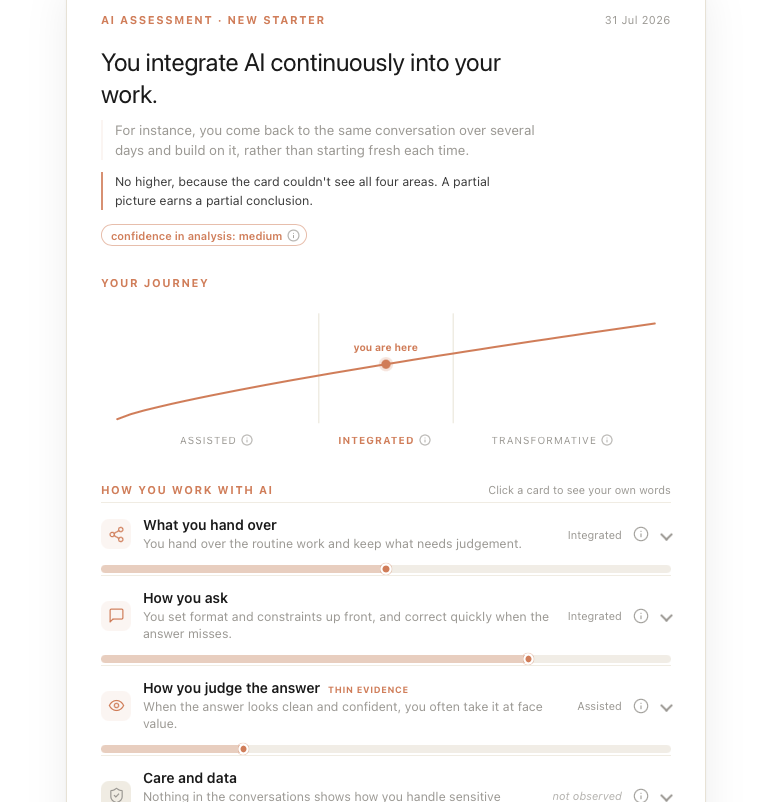

# AI Competence Assessment

A Claude skill that turns a person's own AI conversations into a one-page competence assessment. Actionable  plain-language understanding of how they work
with AI, with evidence surfacing and referencing.

<a href="https://github.com/sebastiannicolajsen/ai-competence-assessment/releases/download/latest/ai-competence-assessment.skill">
  
</a>

 Download the file above, then in Claude go to
**Settings → Capabilities → Skills → Upload skill** and pick the file. Then just ask Claude for an AI competence assessment, or use `/` to select the skill.

<sub>The button hands you a `.skill` file because Safari silently unpacks `.zip` downloads into a folder, and Claude wants the archive, not the folder. If Claude's file picker won't take the `.skill`, rename it to `ai-competence-assessment.zip` and upload that — it is the same archive, byte for byte. On Chrome, Firefox or Edge you can also just take the [`.zip`](https://github.com/sebastiannicolajsen/ai-competence-assessment/releases/download/latest/ai-competence-assessment.zip) directly.</sub>

***Note: when used outside of a project, it does not access chat history from any projects, and vice-versa. Use inside a project to a snapshot of your way of working within that.***

Requires a Claude Pro, Max, Team or Enterprise plan with file creation enabled.



---

## What it produces

One standalone HTML file which serves to illustrate the users current progress towards transformative AI use, exploring areas of practice (according to the AI Fluency framework), how they may improve, open questions, and an indication of confidence in the snapshot.

---

## What it is built on

### 1. The 4D AI Fluency Framework

The four areas of practice map to the **4D Framework** — Delegation, Description, Discernment,
and Diligence, developed by **Prof. Rick Dakan** and **Prof. Joseph Feller**  in partnership with Anthropic. The framework defines AI fluency as working with AI effectively, efficiently, ethically and safely.

- Framework materials: <https://aifluencyframework.org/>
- Course: [AI Fluency: Framework & Foundations](https://anthropic.skilljar.com/ai-fluency-framework-foundations)

The card never shows the framework. The four competencies appear as plain language — *What you hand over*, *How you ask*, *How you judge the answer*, *Care and data* — because a person being assessed on their first week should not have to learn a vocabulary in order to read their own result.

> **Licensing — read before commercial use.** The 4D Framework materials are released under **CC BY-NC-SA 4.0**: attribution required, **non-commercial**, and derivatives must carry the same licence. This repository re-expresses the competencies in its own words rather than reproducing framework text, but whether that constitutes a derivative work is a judgement call, and the non-commercial clause is the one to check before this is used in paid client delivery. 

### 2. A set of honesty constraints, enforced in code

Honesty constraints is something we enforce through code. Every rule below is checked by `scripts/generate_snapshot.py`, which refuses to render a card that breaks one:

| Rule | Why |
|---|---|
| Quotes are verbatim from the person's own messages | An assessment that paraphrases its evidence can say anything |
| Never quote the assistant as evidence of the person | Only their turns show how *they* work |
| Quotes under 150 characters, truncated only at a word boundary | Keeps evidence checkable at a glance |
| Every quote carries the URL of its source conversation | The reader can verify the claim themselves |
| Quotes stay in the language they were written in | Translating a quote breaks it silently |
| No number, score, percentage or count anywhere on the card | A number invites comparison and ranking; this is a development tool |
| An area with no evidence is marked *not observed*, never given a middling score | A guessed 3 looks exactly like a finding |
| Every next move declares which area it came from, and may not come from an unobserved area | Advice built on an absence is indistinguishable from advice built on evidence |
| Gaps become open questions, not recommendations | Absence in a chat log is usually just absence |
| Confidence rounds down; the card states what it could not see | Under-claiming is the honest failure mode |
| The coverage line is derived from the quotes' own source tags, not asserted | A card that describes one slice of someone's AI use must not sound like it saw all of it |

### 3. Practitioner experience

The framing and the choice to lead with a sentence rather than a score come from running AI adoption programmes and training at Implement Consulting Group. That is design experience, not a research basis — see the limits below.

---

## Why this exists

The evidence on where the constraint actually sits is consistent across sources:

- Dansk Industri's member survey found that around four in ten companies use generative AI, and that in roughly four in ten of those, both employees and managers report a competence gap — with more than half reporting that fewer than 20% of employees use it regularly. ([DI, 2024](https://www.danskindustri.dk/vi-radgiver-dig/personale/nyhedsarkiver---personaleforhold/nyheder-om-arbejdsmiljo/2024/6/generativ-ai-virksomheder-oplever-kompetencegab-og-tidsmangel/))
- A CAISA report covered by DI Digital found that while two thirds of Danish SMEs use at least one AI technology, under 10% have it integrated into internal processes or products, and employees' missing AI competence is the barrier most often named by SME leaders. ([DI Digital, 2026](https://www.danskindustri.dk/brancher/di-digital/nyhedsarkiv/nyheder/2026/1/vi-har-talt-meget-om-udbredelsen-af-ai--nu-er-tiden-til-den-handgribelige-implementering/))

**This is context, not method.** Neither source informs how this assessment scores anyone, and nothing here implements a DI recommendation. They establish that the gap is about competence rather than access, which is the problem this tool points at, and that is all they are cited for.

---

## What it can see (and what it can't)

No single run sees all of anyone's AI use. Two boundaries cause this, and both are silent — you
get a complete-looking card either way, which is exactly why the card states its own coverage.

**Where you run it decides what it reads.** Conversation search only reaches the place it is run
from. Run it in a normal chat and it reads your normal chats, but nothing inside your Projects.
Run it inside a Project and it reads that Project, but nothing outside it. There is no warning
and no overlap, so a card built on one side describes half your work in the voice of the whole.

**No assistant can read another one's history.** Claude cannot see ChatGPT, Gemini, Copilot or
Cursor, and none of them can see each other. If most of your real AI work happens somewhere else,
a card built only on Claude chats is a card about a minority of your practice.

### How to widen it

The skill asks about this before it assesses anything, tells you which slice it is holding, and
offers one of these. You can also just say up front where your work actually lives.

| Where your work is | How to get it in |
|---|---|
| A Claude Project | Run the skill again from inside the Project, and ask it to combine the two runs |
| Claude Code | Point the collector at your local transcripts in `~/.claude/projects/` |
| ChatGPT | Settings → Data controls → Export data, then hand over `conversations.json` |
| Gemini | Google Takeout → My Activity → Gemini Apps |
| Anything else | Paste four or five representative conversations into the chat |

```bash
python3 scripts/collect_evidence.py ~/.claude/projects --surface cc > evidence.json
python3 scripts/collect_evidence.py conversations.json --surface gpt > evidence.json
```

The collector only extracts your own messages, verbatim, and drops tool output and command noise.
It never scores or summarises — the same quote rules apply to whatever it returns.

Every quote on the card is tagged with the tool it came from, and the card's coverage line is
built from those tags rather than from anything the model asserts, so it cannot claim to have
seen more than it did. A confident read drawn from a single surface is flagged during generation.

---

## What this is not

Stated plainly, because a tool that assesses people should be honest about its own standing:

- **Not a validated instrument.** No psychometric development, no reliability testing, no norm data, no construct validation. The 1–5 anchors are reasoned, not measured.
- **Not a measurement.** It reads behaviour in the material it is given. It cannot see work in other tools, offline judgement, or anything the person did well without writing it down.
- **Not a performance record.** It is built for a development conversation. Using it as an input to appraisal or hiring would give it a weight the evidence cannot carry.
- **Not comparable between people.** There is deliberately no number, so there is nothing to rank. That is a feature.
- **Not applicable to a third party.** It only works on material the assessed person knowingly provided.

The card states a version of this to the reader as well, it is not confined to this README.

---

## Using it

Install the package with the download button at the top, then ask for an assessment in
either language. The skill gathers the person's recent conversations, reports what it
found, and **waits for confirmation** before assessing anything.

In Claude Code, unzip it into `~/.claude/skills/` instead:

```bash
curl -L -o skill.zip https://github.com/sebastiannicolajsen/ai-competence-assessment/releases/download/latest/ai-competence-assessment.zip
unzip skill.zip -d ~/.claude/skills/
```

Manual use:

```bash
python3 scripts/generate_snapshot.py snapshot.json card.html
```

Standard library only, no dependencies, runs offline. The generator exits non-zero and writes nothing if a safeguard is violated; `--lax` downgrades errors to warnings.

```
ai-competence-assessment/        the skill itself; this folder is what gets packaged
├── SKILL.md                     instructions for the model, plus the name and
│                                description Claude matches a request against
├── references/framework.md      labels, 1–5 anchors, safeguards, surfaces (EN + DA)
├── scripts/generate_snapshot.py renderer + validator
├── scripts/collect_evidence.py  pulls your own turns out of exported conversations
└── assets/                      worked examples, EN and DA
```

`.github/workflows/build-skill.yml` validates the frontmatter, renders both example
snapshots as a smoke test, and republishes the download above on every push to `main`.
